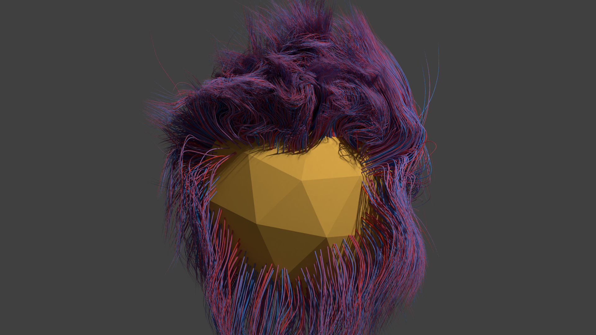
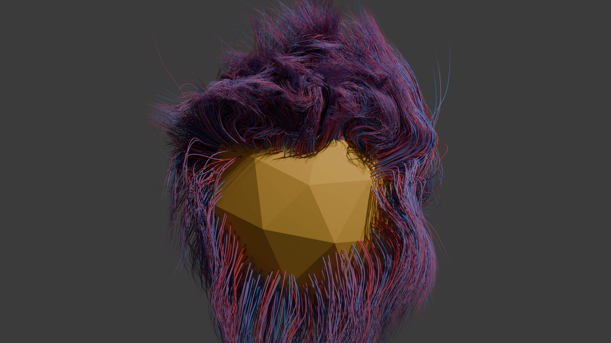
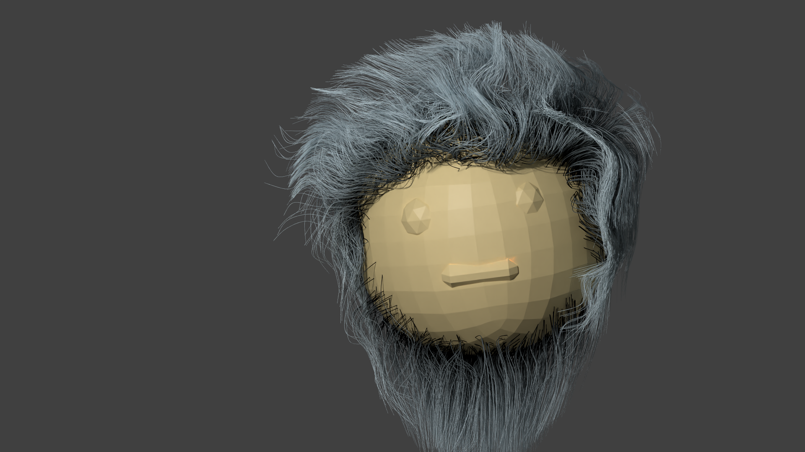
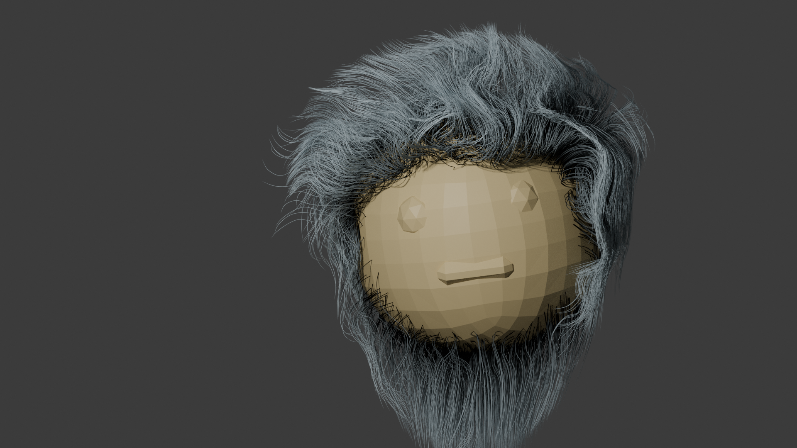

# Renderwave

Renderwave is a fork of [Saarland University's path tracer](https://graphics.cg.uni-saarland.de/courses/cg1-2023/index.html) lightwave, which we extended to the presented version as part of the seminar [Advanced Rendering Techniques (ART)](https://graphics.cg.uni-saarland.de/courses/art-2024/index.html) during the 2024 summer semester. Due to time constraints, there are still some problems for some features but most of the upcoming functionality works.

## Features implemented by me
Apart from the 'basic' functionality we had to implement during the Computer Graphics 1 lecture, during ART I primarily worked on:
* Textures
  * Color Ramp
  * Info texture / nodes
    * Particle Info
    * Curves Info
    * Geometry Info
    * Object Info
* Hair rendering
  * Customizable hair geometry
  * Custom bounding volumes
  * Hair reconstruction from control points
* Extending the Blender exporter to support the already mentioned features and optimized the export of animated shots 
* Some smaller changes to the architecture to support the Info nodes

| Renderwave | Blender |
|--|--|
| |  |
| |  |

## Main topics covered by the rest of the ART team
* Arsenii Dremin: Volumetric rendering
* [Ben Samuel Dierks](https://github.com/Nasenbaer39): Compression and optimization (mesh quantization) as well as motion blur
* [Christian Philipp Singer](https://github.com/Thunfischpirat): Realistic camera models and motion blur
* David Peter Hares: Compositing
* Henry Ludger Janson: Sampling, MIS compensation, realistic sun model and the Blender exporter
* [Johannes Schöneberger](https://github.com/JoeJoeTV): Blender exporter and implementation of BSDFs and textures (advanced materials)
* Leonard Butz: Tessellation-free displacement mapping
* Lianjia Liu: Optimized path space regularization
* Nico Leiner: Practical path guiding using russian roulette strategies
* Tobias Wiedemann: Regularised path tracing and motion blur

We also recreated an animated scene of 'Rogue One: A Star Wars Story' in Blender but ran out of time to actually render in lightwave.

## Features provided by lightwave
Out of the box, lightwave is unable to produce any images, as it lacks all necessary rendering functionality to do so.
It is your job to write the various components that make this possible: You will write camera models, intersect shapes, program their appearance, and orchestrate how rays are traced throughout the virtual scene.
Lightwave supports you in this endeavour by supplying tedious to implement boilerplate, including:

* Modularity
  * Modern APIs flexible enough for sophisticated algorithms
  * Shapes, materials, etc are implemented as plugins
  * Whatever you can think of, you can make a plugin for it
* Basic math library
  * Vector operations
  * Matrix operations
  * Transforms
* File I/O
  * An XML parser for the lightwave scene format
  * Reading and writing various image formats
  * Reading and representing triangle meshes
  * Streaming images to the [tev](https://github.com/Tom94/tev) image viewer
* Multi-threading
  * Rendering is parallelized across all available cores
  * Parallelized scene loading (image loading, BVH building, etc)
* BVH acceleration structure
  * Data-structure and traversal is supplied by us
  * Split-in-the-middle build is supplied as well
  * It's your job to implement more sophisticated building
* Useful utilities
  * Thread-safe logger functionality
  * Assert statements that provide extra context
  * An embedded profiler to identify bottlenecks of your code
  * Random number generators
* A Blender exporter
  * You can easily build and render your own scenes

## Contributors
Lightwave was written by [Alexander Rath](https://graphics.cg.uni-saarland.de/people/rath.html), with contributions from [Ömercan Yazici](https://graphics.cg.uni-saarland.de/people/yazici.html) and [Philippe Weier](https://graphics.cg.uni-saarland.de/people/weier.html).
Many of the design decisions were heavily inspired by [Nori](https://wjakob.github.io/nori/), a great educational renderer developed by Wenzel Jakob.
We would also like to thank the teams behind our dependencies: [ctpl](https://github.com/vit-vit/CTPL), [miniz](https://github.com/richgel999/miniz), [stb](https://github.com/nothings/stb), [tinyexr](https://github.com/syoyo/tinyexr), [tinyformat](https://github.com/c42f/tinyformat), and [pcg32](https://github.com/wjakob/pcg32).
